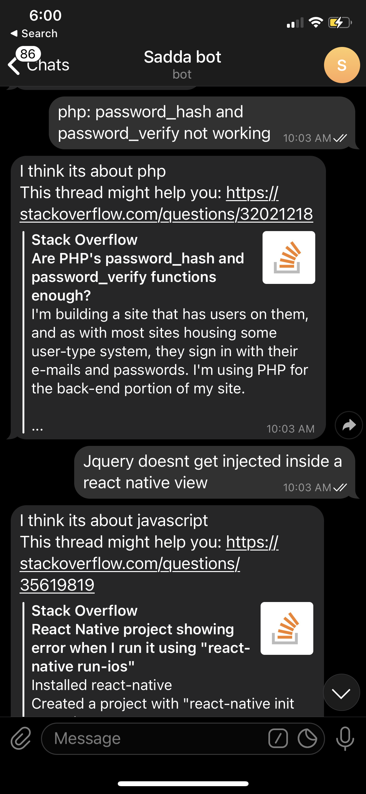
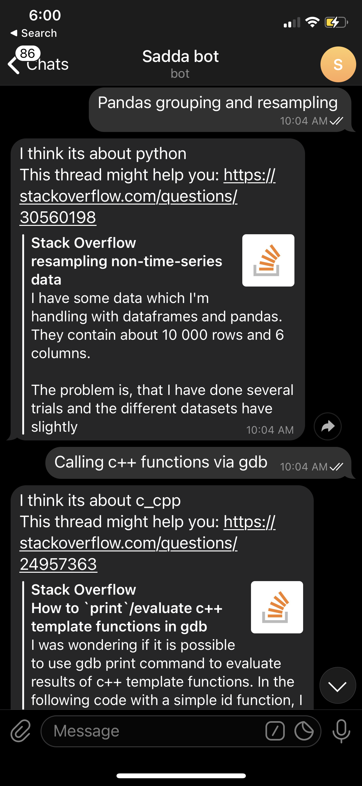
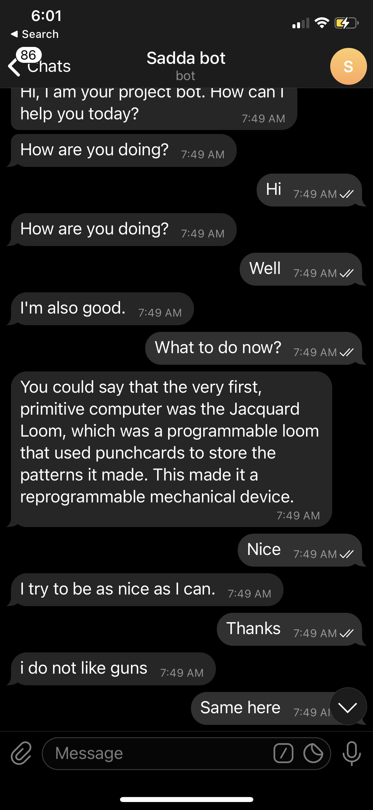

# SO-chatbot
This is a chatbot to give relevant question from stack overflow as answer to message sent via telegram app. It also supports chit chat mode to talk to you in a casual way. This was implemented using `ChatterBot` library in python. 

This is the course project of Natural Language Processing Course on Coursera by National Research University Higher School of Economics (https://www.coursera.org/learn/language-processing/).

The generated weights are available [here](https://drive.google.com/drive/folders/1GV6d2-n4L6dO65n_6nrXAluG3wZRk0-h?usp=sharing). The code is in this repository. The course had 5 weeks, and the mini-projects done in Week 1 and Week 3 were used to construct this final bot. 

The final model was deployed on AWS, and a telegram bot was constructed for easy access to users. However, I had to terminate the AWS instance due to other projects. So it is no longer available on telegram. Below are some screenshots to show how the bot looked like. 

 

 

 

As you can see, the bot performs reasonably well on the stack overflow related questions, but is okayish when it comes to normal chit chat. This is because of the very less training data used for training it for chit chat purposes.
